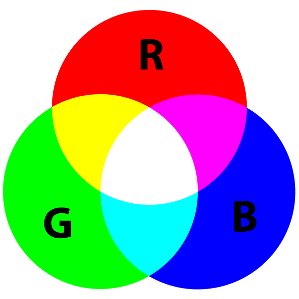

# test-fly
testing flying and learning

## This is a Heading ##

**bold text**

* item 1
* item 2

> this is a blockquote
> and it continues on this line

`inline code`

# JavaScript syntax highlighting
```javascript
function fancyAlert(arg) {
  if(arg) {
    $.facebox({div:'#foo'})
  }
}
```
Task list
- [ ] do a
- [ ] do b

Emoji
:smile:

## Insert image

